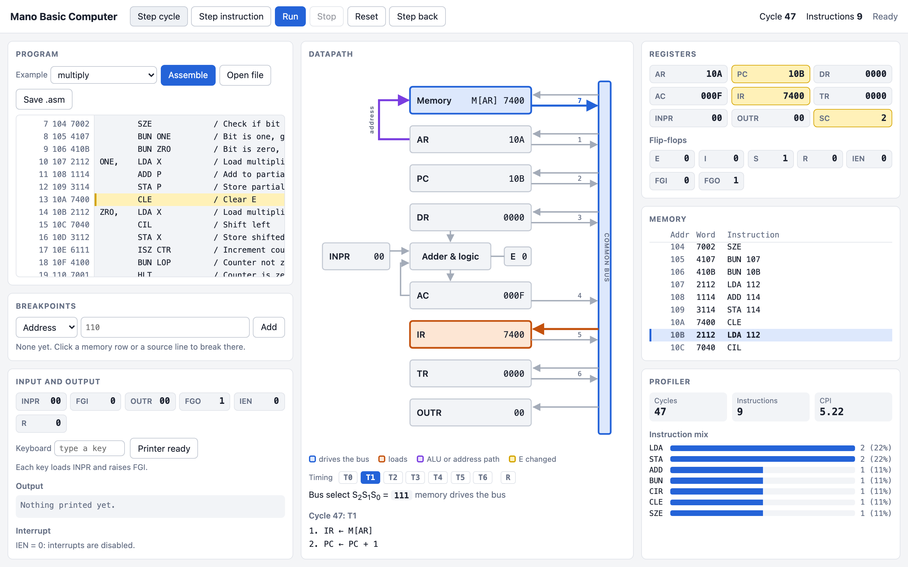
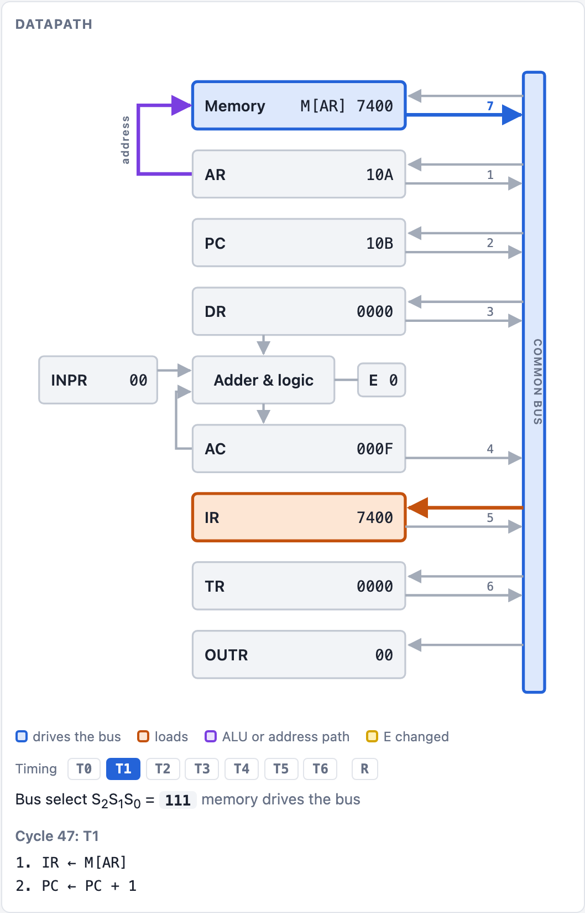
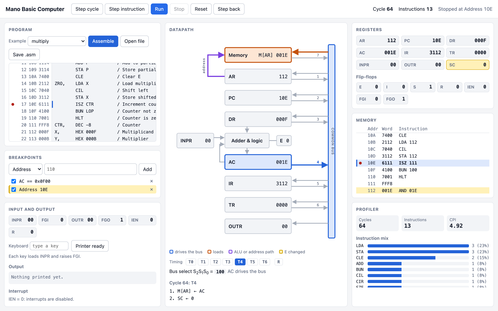
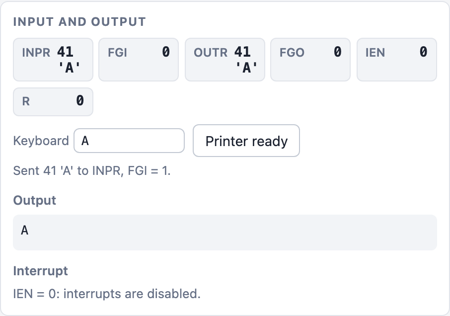

# Mano Basic Computer Simulator

**[Open the live simulator](https://rarya02.github.io/basic-computer-simulator/)**

The Basic Computer is the teaching machine from M. Morris Mano's *Computer System Architecture*: a 16 bit
accumulator machine with 4096 words of memory, seven registers, a handful of flip-flops, and 25 instructions,
all wired around a single shared bus. It is small enough that you can hold the entire datapath in your head,
which is exactly why courses use it to explain how a CPU actually works: every instruction is spelled out as
register transfers that happen on numbered clock cycles, so "the CPU executes an instruction" turns into a
concrete sequence you can watch. This simulator runs that machine a clock cycle at a time in the browser and
shows what each cycle does, which register drives the bus, which register loads, and how memory and the flags
change, so you can check your understanding against the hardware instead of against an answer key.

## Screenshots

Drop images in at these paths and they will appear here.









## Features

- **Cycle-accurate stepping.** Step one clock cycle or one whole instruction. Every cycle reports its timing
  signal T0 to T6, the microoperations it performed in register transfer notation, and everything that changed.
- **Datapath view.** An SVG of the common bus datapath that highlights the register driving the bus, the
  S2S1S0 bus select code, the register being loaded, and the path through the adder and logic circuit.
- **Step backwards.** Undo the last clock cycle, repeatedly, using a delta log of what each cycle changed
  rather than snapshots of the whole machine. Keystrokes are undone in order along with the cycles.
- **Breakpoints.** Break on an address by clicking a memory row or a source line, or on a register condition
  such as `AC == 0` or `PC >= 0x110`. Each one can be disabled or removed, and a run that stops says which
  breakpoint fired.
- **Assembler.** A two pass assembler with a symbol table and real diagnostics that carry line and column
  numbers, shown against the offending line in the editor.
- **Interrupts and I/O.** INPR, OUTR and the FGI, FGO, IEN and R flip-flops, with a keyboard that raises FGI
  and an output log. When an interrupt diverts a fetch, the panel reports the return address it saved, where
  it saved it, and the vector it entered.
- **Profiler.** Cycle count, instruction count, CPI, and a histogram of the instruction mix.

## Architecture

The interesting part of this repository is not the GUI, it is that a TypeScript rewrite is held to the
behavior of the original Python implementation, cycle by cycle, by the test suite.

| Directory | What it holds |
| --- | --- |
| `core/` | The simulator and assembler in TypeScript. No DOM and no Node APIs, so the same code runs under vitest and in the browser. |
| `web/` | The Vite app. It imports from `core/`, and nothing in `core/` imports from it. The machine runs inside a Web Worker so a long run cannot freeze the page. |
| `tests/` | The vitest suites, plus golden traces generated from the Python reference. |
| `reference/` | The original Python implementation, kept unchanged as the behavioral reference. It still runs, with its own CLI and Tkinter GUI. |
| `programs/` | Assembly programs shared by both implementations, so both can be run on exactly the same input. |

### Differential testing against the Python reference

`tests/golden/generate.py` runs every program in `programs/` through the Python simulator and writes one line
per clock cycle: the cycle number, the timing signal, and the full register and flip-flop state. Those traces
are committed. `tests/golden.test.ts` then runs the same programs through the TypeScript core and asserts the
emitted trace matches the committed one exactly, so any divergence shows up as a specific cycle rather than as
a wrong answer at the end.

Three places where the TypeScript core deliberately does not match the Python code, because the Python code is
wrong about the hardware:

- Indirect addressing hangs the Python machine, since the step counter never advances past the extra fetch.
- The I/O instructions hang it the same way, so `INP`, `OUT`, `SKI`, `SKO`, `ION` and `IOF` never complete.
- `CIL` rotates left without carrying AC(15) into E or E into AC(0).

None of those paths are reached by the traced programs, which is why the traces still match. The corrected
behavior is pinned by separate tests instead, next to tests for the interrupt cycle, which the Python version
does not model at all. The rest of the suite covers the assembler diagnostics, the disassembler, reverting
every cycle of every program back to the loaded machine, and the GUI's own state model.

## Assembly language

A statement is an optional label, an instruction or directive, and its operand. Comments start with `/` and run
to the end of the line, and `#` is accepted too.

```asm
/ Multiply two positive numbers by shift and add
        ORG 100
LOP,    CLE             / Clear E
        LDA Y           / Load the multiplier
        CIR             / Shift the low bit into E
        STA Y
        SZE             / Skip if that bit was zero
        BUN ONE
        BUN ZRO
ONE,    LDA X
        ADD P
        STA P
ZRO,    LDA X
        CIL
        STA X
        ISZ CTR         / Count this pass
        BUN LOP
        HLT
CTR,    DEC -8
X,      HEX 000F
Y,      HEX 000B
P,      HEX 0
        END
```

### Labels

A label is a name, then a comma, before the instruction: `LOP, CLE`. It may sit on its own line. Names start
with a letter followed by letters or digits, must be unique, and cannot be an instruction mnemonic, a
directive, or `I`. A label stands for the address of the word it marks, and execution starts at the lowest
address that holds an instruction.

### Directives

| Directive | Meaning |
| --- | --- |
| `ORG hhh` | Assemble what follows starting at hexadecimal address `hhh`, from 000 to FFF. |
| `END` | End of the program. Anything after it is ignored. |
| `HEX v` | One word of data, hexadecimal, from 0 to FFFF. |
| `DEC v` | One word of data, decimal, from -32768 to 65535, stored as two's complement. |

### Memory reference instructions

Each takes an address, written as a label or as hexadecimal. Add ` I` after the operand for indirect
addressing, as in `ADD PTR I`, which sets bit 15 of the word.

| Mnemonic | Opcode | Effect |
| --- | --- | --- |
| `AND` | 0 | AC receives AC and the addressed word |
| `ADD` | 1 | AC receives AC plus the addressed word, carry into E |
| `LDA` | 2 | AC receives the addressed word |
| `STA` | 3 | The addressed word receives AC |
| `BUN` | 4 | Branch unconditionally |
| `BSA` | 5 | Save the return address and branch to the word after it |
| `ISZ` | 6 | Increment the addressed word, skip the next instruction if it becomes zero |

### Register reference instructions

| Mnemonic | Code | Effect |
| --- | --- | --- |
| `CLA` | 7800 | Clear AC |
| `CLE` | 7400 | Clear E |
| `CMA` | 7200 | Complement AC |
| `CME` | 7100 | Complement E |
| `CIR` | 7080 | Rotate AC right through E |
| `CIL` | 7040 | Rotate AC left through E |
| `INC` | 7020 | Increment AC |
| `SPA` | 7010 | Skip the next instruction if AC is positive |
| `SNA` | 7008 | Skip the next instruction if AC is negative |
| `SZA` | 7004 | Skip the next instruction if AC is zero |
| `SZE` | 7002 | Skip the next instruction if E is zero |
| `HLT` | 7001 | Halt |

### Input and output instructions

| Mnemonic | Code | Effect |
| --- | --- | --- |
| `INP` | F800 | AC(0-7) receives INPR, clear FGI |
| `OUT` | F400 | OUTR receives AC(0-7), clear FGO |
| `SKI` | F200 | Skip the next instruction if FGI is set |
| `SKO` | F100 | Skip the next instruction if FGO is set |
| `ION` | F080 | Enable interrupts |
| `IOF` | F040 | Disable interrupts |

## Local development

Node 22 or newer is enough for everything except regenerating the golden traces, which needs Python 3.

```bash
npm install
npm run dev        # http://localhost:5173/basic-computer-simulator/
npm test           # the full vitest suite, including the golden traces
npm run typecheck  # core, tests, the page, and the worker
npm run build      # production build into dist/
npm run preview    # serve that build locally
npm run golden     # regenerate the golden traces from the Python reference
```

The Python implementation still runs on its own:

```bash
python3 reference/main.py
```

The app is served from a project subpath on GitHub Pages, so the Vite `base` is set in
`web/vite.config.ts` and the dev server URL carries that prefix too. Pushing to `main` runs the type checks and
the full test suite, and deploys only if they pass.

## Credits

This project began as a COE 341 team project written in Python, which is preserved unchanged in `reference/`.
The TypeScript rewrite, the browser GUI, and the differential test suite against the Python implementation are
solo work.

## License

MIT, see [LICENSE](LICENSE).
